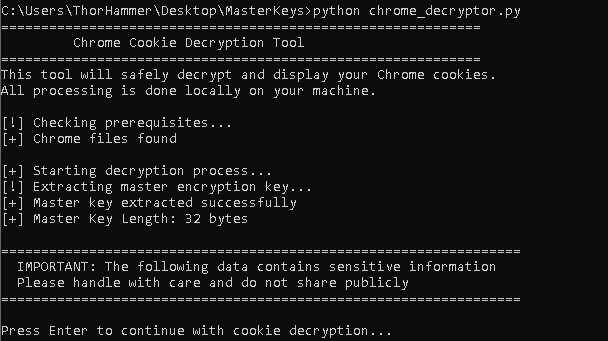
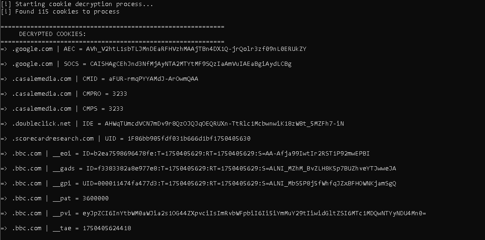
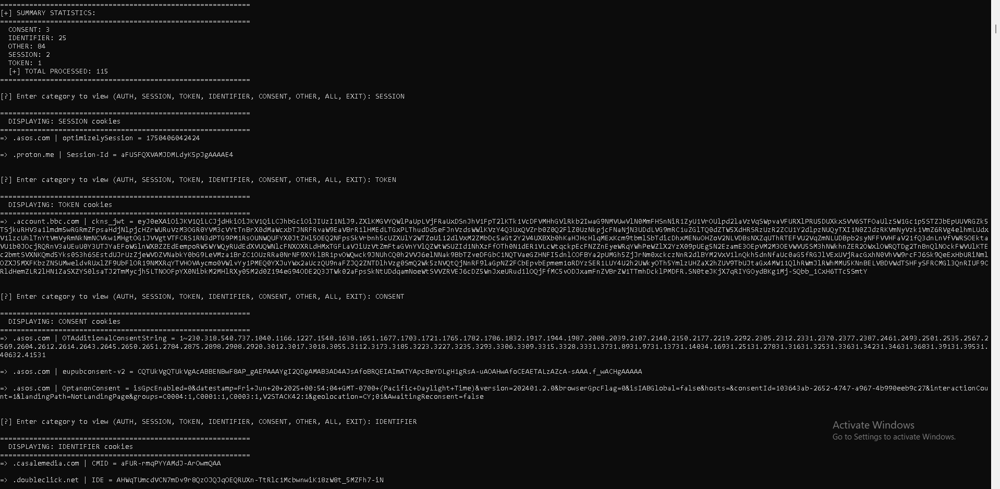
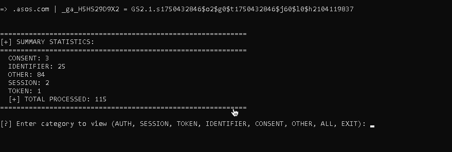
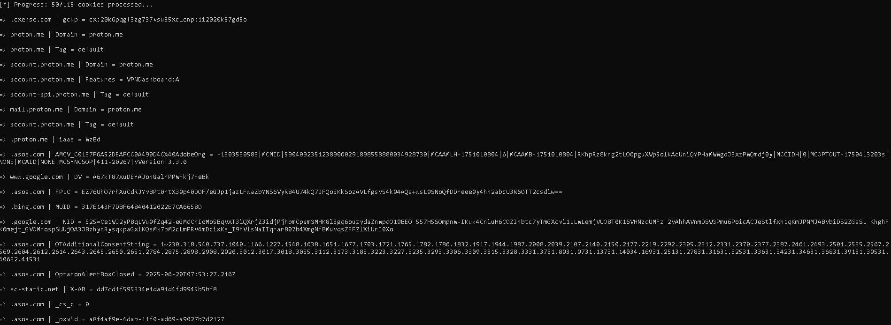

# Chrome-Decryptor-Tool-128

# 🛡️ Chrome Decryptor

**Chrome Decryptor** is a forensic and red-team utility developed during a cybersecurity internship. It decrypts cookies stored in modern versions of Google Chrome (v80+), including those encrypted using the AES-GCM scheme, and categorizes sensitive values like session tokens, user identifiers, and JWTs.

Originally inspired by limitations in *ChromeCookieView* by NirSoft (which no longer supports newer Chrome versions), this tool operates **completely offline**, requiring only local files and no browser interaction.

---

## 🔍 Features

- ✅ Extracts the AES encryption key from Chrome's `Local State` file
- 🔓 Decrypts cookies stored in Chrome’s `Cookies` SQLite DB
- 🧩 Identifies sensitive values:  
  - Session tokens  
  - Authentication cookies  
  - JWTs  
  - User identifiers  
  - Consent flags
- 🔎 Search cookie categories
- 📁 Works offline (from a memory dump or Chrome profile backup)
- 🚨 Avoids security detection or browser alerts
- 📊 Displays clean, categorized output with emoji stats

---

## 🚀 Quick Start

1. **Ensure Chrome is closed.**
2. **Run the script:**

```bash
python chrome_decryptor.py
```

The script will:
- Check if the necessary files exist
- Extract the AES encryption key
- Decrypt all cookies and print them in categorized format

> 🔐 You’ll be warned before sensitive data is shown — press Enter to proceed.

---

## 📦 Example Output

```
🌐 .example.com | session_id = abc123def456...
🌐 auth.site.net | access_token = (JSON)
{
  "value": "eyJhbGciOiJIUzI1NiIsInR..."
}
```

---

## 📂 File Requirements

The script looks for the following files under the default Chrome profile path:

- `Local State` (for the AES key)
- `Cookies` (SQLite database of encrypted cookie values)

These are typically located under:

```
C:\Users\<YourUsername>\AppData\Local\Google\Chrome\User Data\...
```

---

## ⚙️ Dependencies

Below is your **`requirements.txt`** file — based on the actual imports in your code:

```txt
pycryptodome
pywin32
```

To install them:

```bash
pip install -r requirements.txt
```

> ℹ️ `sqlite3`, `json`, `os`, `base64`, and `re` are part of Python’s standard library.

---

## ⚠️ Disclaimer

This tool is intended **strictly for ethical, educational, or forensic use only**.  
Using it on systems you do not own or without consent may violate laws and ethical guidelines.

**Use responsibly.**

---

## 📜 License

This project is licensed under the MIT License. See the [LICENSE](LICENSE) file for more information.

---

## 🙋‍♂️ Author

**Theodoros**  
Junior Penetration Tester - Intern

## 🖼️ Screenshots

### 🔐 Master Key Extraction and Decryption Prompt


---

### 📋 Decrypted Cookies Output (Part 1)


---

### 📋 Decrypted Cookies Output (Part 2)


---

### 📊 Summary Statistics by Category


---

### 🔍 Viewing Cookies by Category (e.g., SESSION, TOKEN, CONSENT)

